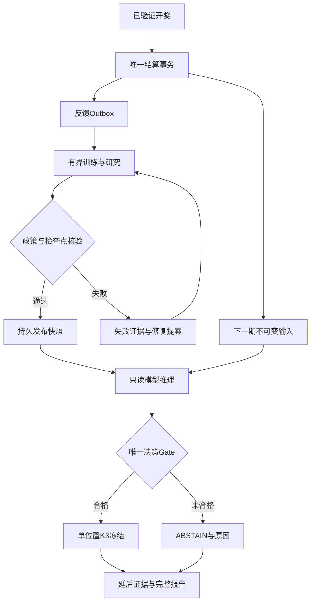
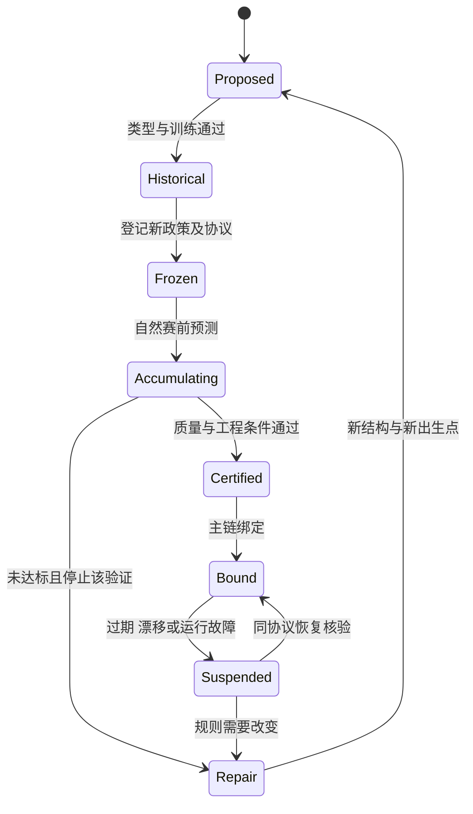

# 架构与状态图

实时与研究通过持久事件连接，写入仍归原Owner。

```mermaid
flowchart TD
  A[已验证开奖] --> B[唯一结算事务]
  B --> C[反馈Outbox]
  B --> D[下一期不可变输入]
  C --> E[有界训练与研究]
  E --> F{政策与检查点核验}
  F -->|通过| G[持久发布快照]
  F -->|失败| H[失败证据与修复提案]
  H --> E
  G --> I[只读模型推理]
  D --> I
  I --> J{唯一决策Gate}
  J -->|合格| K[单位置K3冻结]
  J -->|未合格| L[ABSTAIN与原因]
  K --> M[延后证据与完整报告]
  L --> M
```

```mermaid
stateDiagram-v2
  [*] --> Proposed
  Proposed --> Historical: 类型与训练通过
  Historical --> Frozen: 登记新政策及协议
  Frozen --> Accumulating: 自然赛前预测
  Accumulating --> Certified: 质量与工程条件通过
  Accumulating --> Repair: 未达标且停止该验证
  Certified --> Bound: 主链绑定
  Bound --> Suspended: 过期 漂移或运行故障
  Suspended --> Bound: 同协议恢复核验
  Suspended --> Repair: 规则需要改变
  Repair --> Proposed: 新结构与新出生点
```

图中的Bound仍需每期经过唯一Gate；证书不意味着每期无条件REAL。研究只能提出候选，不能直接写正式动作。
